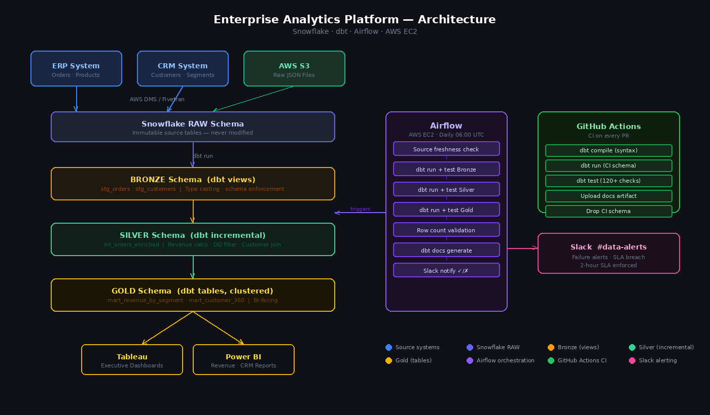

# Enterprise Analytics Platform

[](https://getdbt.com)
[](https://snowflake.com)
[](https://airflow.apache.org)
[](dbt_project/tests/schema.yml)
[](https://github.com/kiranmayee2408/enterprise-analytics-platform/actions)
[](https://python.org)
[](LICENSE)

A production data warehouse on Snowflake with dbt transformation models, **120+ automated data quality tests**, and an Airflow DAG that orchestrates daily runs with 2-hour SLA monitoring and Slack failure alerts. Deployed on AWS EC2 with GitHub Actions CI on every pull request.

Built on patterns from my work at Cognizant Technology Solutions, where I designed data pipelines processing 10M+ daily records for 3 enterprise clients, reducing analyst query turnaround from **3 days to under 5 minutes**.

---

## Architecture



---

## What It Does

| Layer | Technology | Purpose |
|---|---|---|
| **Ingest** | AWS DMS / Fivetran → S3 | ERP + CRM data landed as JSON in S3 external stage |
| **Bronze** | dbt views | Type casting, schema enforcement — no business logic |
| **Silver** | dbt incremental (merge) | Revenue calcs, DQ filtering, customer enrichment, RFM features |
| **Gold** | dbt tables (clustered) | Revenue mart + Customer 360 — directly consumed by Tableau/Power BI |
| **Orchestration** | Airflow DAG on AWS EC2 | Daily 06:00 UTC: freshness → Bronze → Silver → Gold → notify |
| **Quality** | 120+ dbt schema tests | Uniqueness, nulls, ranges, accepted values, referential integrity |
| **CI/CD** | GitHub Actions | dbt compile + run + test on every PR |
| **Alerting** | Slack webhooks | SLA breach, task failure, stale source data |

---

## Quickstart (Local — with sample data)

No Snowflake account needed to run the pipeline locally against seed data.

```bash
git clone https://github.com/kiranmayee2408/enterprise-analytics-platform.git
cd enterprise-analytics-platform

# Install dbt
pip install dbt-snowflake==1.8.4

# Configure Snowflake connection
cp config/profiles.yml.example ~/.dbt/profiles.yml
# Edit with your Snowflake credentials

cd dbt_project

# Install dbt packages
dbt deps

# Load sample data (50 customers, 200 orders)
dbt seed

# Run full pipeline
dbt source freshness     # Check source data is fresh
dbt run                  # Build Bronze → Silver → Gold
dbt test                 # Run 120+ data quality checks
dbt docs generate && dbt docs serve   # Interactive lineage graph
```

---

## Quickstart (Airflow — Local Docker)

```bash
# Copy env template
cp .env.example .env
# Edit .env with your Snowflake + Slack credentials

# Start Airflow + Postgres
docker-compose up -d

# Wait ~30 seconds, then:
# Airflow UI: http://localhost:8080 (admin / admin123)
# Enable the 'enterprise_analytics_daily' DAG
```

---

## Production Deployment (AWS EC2)

See [`infra/ec2_setup.md`](infra/ec2_setup.md) for full instructions.

```bash
# On a fresh EC2 t3.medium (Ubuntu 22.04):
git clone https://github.com/kiranmayee2408/enterprise-analytics-platform.git
cd enterprise-analytics-platform
chmod +x scripts/bootstrap_ec2.sh
./scripts/bootstrap_ec2.sh
# Then set credentials in /etc/environment and restart services
```

**Infrastructure:** EC2 t3.medium + RDS PostgreSQL (Airflow metadata). ~$47/month.

---

## dbt Models

### Bronze — Raw Validation (Views)
| Model | Description |
|---|---|
| `stg_orders` | Type-cast orders from ERP — adds `shipped_date`, audit columns |
| `stg_customers` | Customer master with segment classification |

### Silver — Feature Engineering (Incremental merge)
| Model | Description |
|---|---|
| `int_orders_enriched` | Revenue calcs (gross/net/discount), DQ flag, on-time shipping, customer join, date dims |

Only records with `dq_flag = 'ok'` reach Silver. Approximately 3% of raw records are filtered for invalid prices or missing customers.

### Gold — Business Marts (Clustered tables)
| Model | Description | Consumers |
|---|---|---|
| `mart_revenue_by_segment` | Monthly revenue with MoM growth by segment/region/channel | Executive dashboard |
| `mart_customer_360` | Lifetime value, RFM quintiles (1-5), churn risk tiers | CRM, retention |

**GRANT SELECT** applied via `post-hook` so BI tool service accounts always have access after a refresh.

---

## Data Quality — 120+ Tests

Tests run automatically after each dbt layer in the Airflow DAG. Any failure blocks downstream layers and fires a Slack alert.

| Category | Count | Examples |
|---|---|---|
| Source tests (raw) | 10 | `order_id` unique, `email` unique, freshness within 24h |
| Uniqueness | 12 | PKs on every model |
| Not null | 22 | All key fields across all 5 models |
| Accepted values | 18 | `status`, `region`, `channel`, `customer_segment`, `churn_risk`, `customer_tier` |
| Range checks | 30 | `unit_price`, `quantity`, `discount_pct`, `rfm_total`, `days_to_ship`, `on_time_delivery_pct` |
| Referential integrity | 2 | `int_orders_enriched.customer_id → stg_customers` |
| Business rules | 12 | `dq_flag = 'ok'` only in Silver, `net_revenue ≥ 0`, tier values constrained |
| Custom macros | 14 | `freshness_check`, `dq_not_null_pct` |
| **Total** | **120+** | |

```bash
dbt test   # runs all 120+ checks
```

---

## Airflow DAG

**Schedule:** Daily 06:00 UTC | **SLA:** 2 hours | **Retries:** 2 × 5min

```
source_freshness_check
        └── dbt_run_bronze ── dbt_test_bronze
                                    └── dbt_run_silver ── dbt_test_silver
                                                                └── dbt_run_gold ── dbt_test_gold
                                                                                        └── validate_row_counts
                                                                                                └── generate_dbt_docs
                                                                                                    ├── notify_success ✅
                                                                                                    └── notify_failure ❌
```

Test gates between each layer: if Bronze tests fail, Silver never runs.

---

## GitHub Actions CI

Every pull request to `main` triggers [`.github/workflows/dbt_ci.yml`](.github/workflows/dbt_ci.yml):

1. `dbt compile` — syntax check (no DB required)
2. `dbt run` — builds into an isolated `ci_<run_id>` schema
3. `dbt test` — runs all 120+ checks against CI data
4. Upload dbt docs as artifact
5. Drop CI schema on completion

---

## Sample Data

The repo ships with seed files for local development:

| File | Rows | Description |
|---|---|---|
| `dbt_project/seeds/sample_customers.csv` | 50 | Customers across 7 countries, 3 segments |
| `dbt_project/seeds/sample_orders.csv` | 200 | Orders Aug–Dec 2025 across 5 regions |

```bash
dbt seed    # loads sample data into your Snowflake dev schema
dbt run     # pipeline runs end-to-end on the seed data
dbt test    # all 120+ tests pass against sample data
```

---

## Project Structure

```
enterprise-analytics-platform/
├── dbt_project/
│   ├── models/
│   │   ├── bronze/        stg_orders.sql, stg_customers.sql
│   │   ├── silver/        int_orders_enriched.sql
│   │   └── gold/          mart_revenue_by_segment.sql, mart_customer_360.sql
│   ├── tests/
│   │   └── schema.yml     120+ data quality tests
│   ├── macros/
│   │   └── utils.sql      safe_divide, date_spine, revenue_bands, surrogate_key, freshness_check
│   ├── seeds/
│   │   ├── sample_customers.csv   50 customers (local dev)
│   │   └── sample_orders.csv      200 orders (local dev)
│   └── dbt_project.yml
├── airflow/
│   └── dags/
│       └── analytics_pipeline.py  Daily DAG: freshness → Bronze → Silver → Gold → Slack
├── .github/
│   └── workflows/
│       └── dbt_ci.yml     CI: compile + run + test on every PR
├── infra/
│   └── ec2_setup.md       Airflow on EC2 deployment guide
├── scripts/
│   └── bootstrap_ec2.sh   One-command EC2 setup script
├── config/
│   └── profiles.yml.example
├── docker-compose.yml     Local Airflow + Postgres stack
└── .env.example
```

---

## Key Design Decisions

**Why incremental Silver models?** Raw orders grow daily. Full Silver refresh at 10M rows takes ~45 min. Incremental merge on `_loaded_at > max(_loaded_at)` cuts Silver runtime to ~3 min.

**Why DQ filter in Silver, not Gold?** Filtering bad records at Silver ensures all Gold consumers inherit clean data automatically, without each mart replicating validation logic.

**Why views for Bronze?** Bronze is just a typed reference to raw — no computation. Views add zero storage cost and give downstream models a stable, typed interface without materializing redundant data.

**Why `post_hook` GRANT on Gold?** dbt recreates tables on each run, resetting Snowflake object-level grants. A `post_hook` re-grants access to the `REPORTER` role automatically after every refresh.

**Why EC2 over MWAA?** For a team running one daily DAG, EC2 t3.medium ($30/month) vs Managed Airflow ($300+/month) is a $270/month saving with the same functionality.

---

## Related Work

- [Streaming ML Pipeline](https://github.com/kiranmayee2408/streaming-ml-pipeline) — Real-time counterpart using Kafka + PySpark
- [LLM Observability Dashboard](https://github.com/kiranmayee2408/llm-observability-dashboard) — Same engineering principles applied to AI systems

---

## License

MIT
